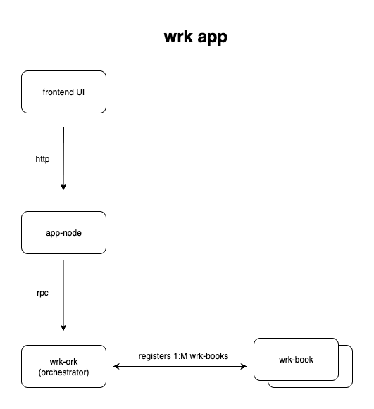
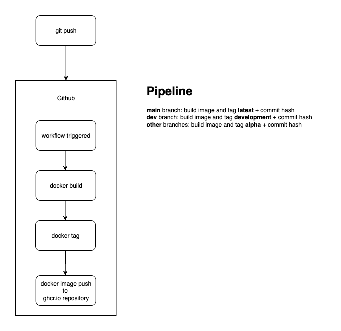
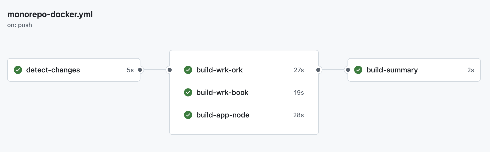

# wrk (monorepo)

Documentation for the wrk project.

Original polyrepo docs: https://github.com/rob-j-au/wrk-docs

### Architecture

### Dependencies

- https://github.com/rob-j-au/tpl-work-thing
- https://github.com/rob-j-au/wrk-base

### Services

- [wrk-book](wrk-book)
- [wrk-ork](wrk-ork)
- [app-node](app-node)

### Docker

#### Dockerfiles

- [wrk-book](wrk-book/Dockerfile)
- [wrk-ork](wrk-ork/Dockerfile)
- [app-node](app-node/Dockerfile)

#### Github Docker Build & Push Workflow

- [.github/workflows/monorepo-docker.yml](.github/workflows/monorepo-docker.yml)

A workflow that detects which services have changed (wrk-book, wrk-ork, app-node), builds and pushes them to GitHub Container Registry.

#### Docker Builds (w /caching)

- https://github.com/rob-j-au/wrk/actions

#### Docker Registry Images

- [wrk-book](https://github.com/rob-j-au/wrk/pkgs/container/wrk%2Fwrk-book)
- [wrk-ork](https://github.com/rob-j-au/wrk/pkgs/container/wrk%2Fwrk-ork)
- [app-node](https://github.com/rob-j-au/wrk/pkgs/container/wrk%2Fapp-node)

### Docker Compose Stack

Instructions to run the wrk services using docker compose

- [wrk-compose](wrk-compose)

